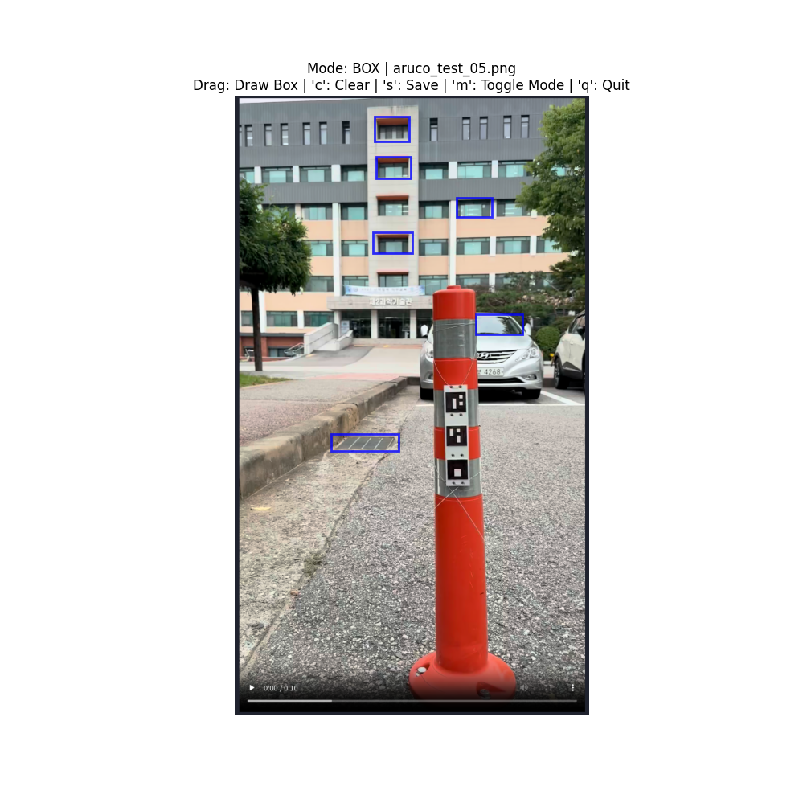
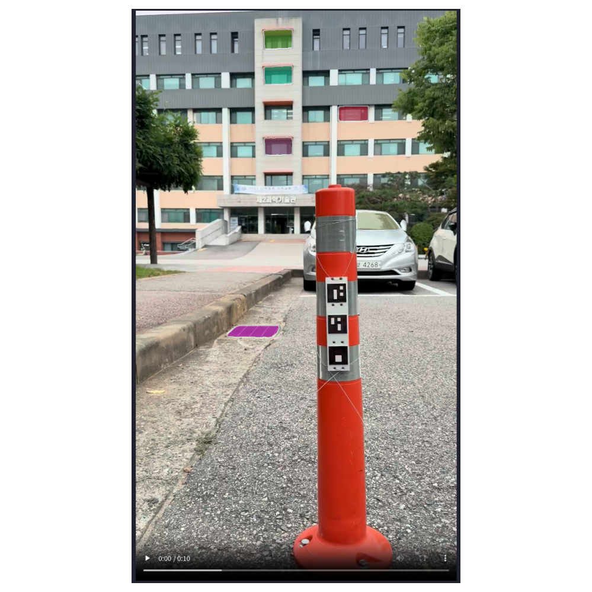
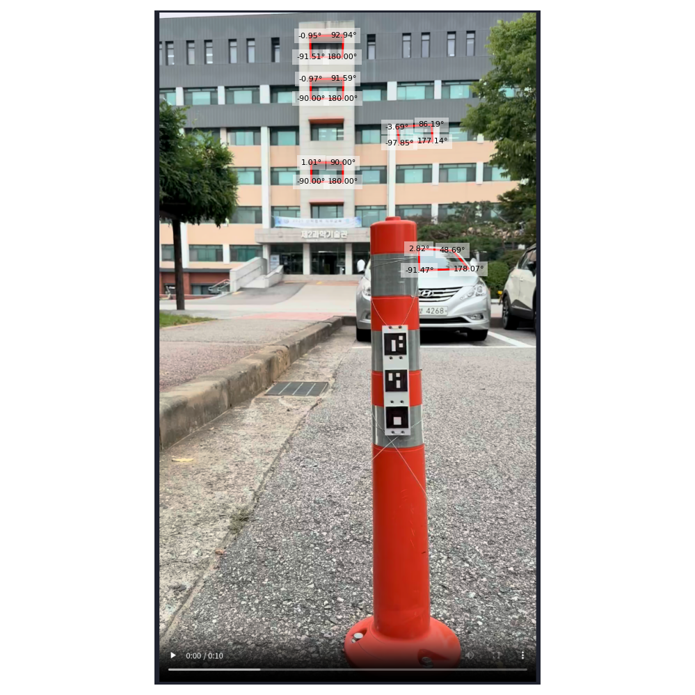
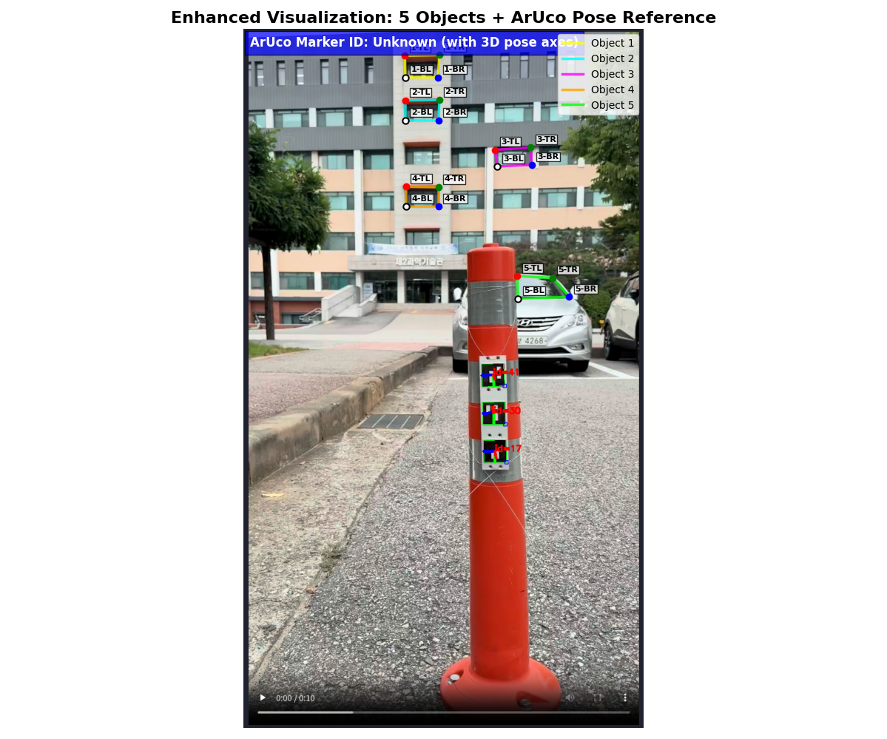
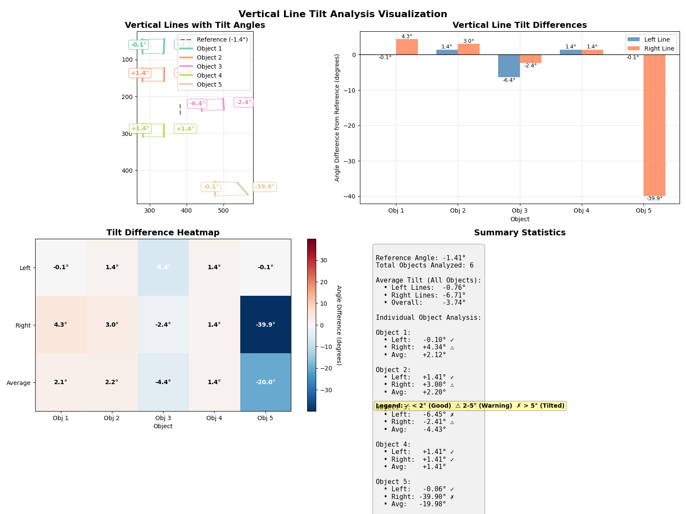

# AIRO-Tilt

### 객체 기울기 분석 시스템

- 개발기간 : 25.07.01 ~ 진행중
- 최신버전 : v0.1

## 시작 가이드

### 요구사항
- Python 3.10 이상
- CUDA 지원 GPU (선택사항)
- SAM2 모델 체크포인트

### 설치
```bash
# uv 사용 (권장)
$ uv sync

# 또는 pip 사용
$ python -m venv venv
$ source venv/bin/activate  # Windows: venv\Scripts\activate
$ pip install -r requirements.txt
```

### 모델 설정
```bash
# SAM2 모델 다운로드
$ wget https://dl.fbaipublicfiles.com/segment_anything_2/092824/sam2.1_hiera_large.pt -P checkpoints/
```

### 실행
```bash
# 메인 애플리케이션 실행
$ python src/sam2_coordinate_runner.py

# Docker로 실행 (CPU)
$ docker-compose up airo-tilt

# Docker로 실행 (GPU)
$ docker-compose --profile gpu up airo-tilt-gpu
```

## 프로젝트 설명

SAM2(Segment Anything Model 2)와 ArUco 마커를 활용한 AI 기반 객체 분할 및 기울기 분석 시스템입니다.

### 주요 기능
- **인터랙티브 객체 분할**: 포인트 클릭 또는 바운딩 박스로 객체 선택
- **ArUco 마커 검출**: 참조점으로 사용되는 ArUco 마커 자동 감지 및 포즈 추정
- **기울기 분석**: ArUco 마커를 기준으로 객체들의 상대적 기울기 계산
- **다중 객체 지원**: 여러 객체를 동시에 분석하고 시각화
- **기하학적 정규화**: 일관된 분석을 위한 표준화된 컨투어 표현

## 스크린샷

### 사각형 선택 모드


### 세그먼트 결과


### 사각형 선택 모드


### 사각형 추출 결과


### 정규화된 꼭짓점 시각화


### 수직선 기울기 분석


## 프로젝트 히스토리

- 1차 작업 (25.07.01 ~ 25.07.10)
  - v0.1-alpha
  - 프로젝트 초기 설정 및 Docker 환경 구축
  - SAM2 모델 통합 및 기본 분할 기능 구현
  - 인터랙티브 좌표 수집 UI 개발 (CoordinateCollector)
  - 기본 시각화 기능 구현 (Visualizer)

- 2차 작업 (25.09.08 ~ 진행중)
  - v0.1
  - ArUco 마커 검출 및 포즈 추정 기능 추가
  - 기울기 차이 분석 알고리즘 구현
  - 수직선 기반 기울기 비교 기능 추가
  - 실시간 비디오 처리 기능 개발

## 사용 기술

`Python` `SAM2` `PyTorch` `OpenCV` `ArUco` `Matplotlib` `Docker`

## 프로젝트 파일 구조

```
/
├─checkpoints/          # SAM2 모델 체크포인트
│  └─sam2.1_hiera_large.pt
├─images/               # 테스트 이미지
│  ├─aruco_test_*.png   # ArUco 마커 테스트 이미지
│  └─erica*.jpg         # 일반 테스트 이미지
├─output/               # 분석 결과 출력
│  ├─blurred.jpg
│  ├─contours.jpg
│  ├─edges.jpg
│  └─rectangles.jpg
├─sam2/                 # SAM2 모델 라이브러리
│  ├─configs/           # 모델 설정 파일
│  ├─modeling/          # 모델 구현
│  └─utils/             # 유틸리티 함수
├─src/                  # 소스 코드
│  ├─core/              # 핵심 모듈
│  │  ├─__init__.py
│  │  └─sam2_predictor.py
│  ├─ui/                # UI 컴포넌트
│  │  ├─__init__.py
│  │  ├─coordinate_collector.py
│  │  └─visualizer.py
│  ├─utils/             # 유틸리티 모듈
│  │  ├─__init__.py
│  │  ├─aruco_marker.py
│  │  ├─device_manager.py
│  │  ├─geometry.py
│  │  └─image_loader.py
│  └─sam2_coordinate_runner.py  # 메인 실행 파일
├─tests/                # 테스트 코드
│  └─test_aruco_marker.py
├─videos/               # 비디오 파일
├─docker-compose.yaml   # Docker 설정
├─dockerfile            # Docker 이미지 정의
├─pyproject.toml        # 프로젝트 설정 (uv)
├─requirements.txt      # 의존성 목록
└─uv.lock               # 의존성 락 파일
```

> **checkpoints/**
> - SAM2 모델 체크포인트 저장 디렉토리
> - sam2.1_hiera_large.pt: 대용량 SAM2 모델 파일

> **images/**
> - 테스트용 이미지 파일 디렉토리
> - ArUco 마커가 포함된 테스트 이미지
> - 일반 객체 분할 테스트 이미지

> **output/**
> - 분석 결과 및 중간 처리 이미지 저장
> - 윤곽선, 엣지, 사각형 추출 결과 등

> **sam2/**
> - Facebook Research의 SAM2 모델 구현
> - 모델 설정, 백본 네트워크, 디코더 등 포함

> **src/core/**
> - SAM2Predictor: SAM2 모델 인터페이스
> - 포인트 및 박스 기반 분할 기능

> **src/ui/**
> - CoordinateCollector: 사용자 입력 수집 (포인트/박스)
> - Visualizer: 마스크, 컨투어, ArUco 마커 시각화

> **src/utils/**
> - ArUcoMarkerDetector: ArUco 마커 검출 및 포즈 추정
> - Geometry: 기울기 분석 및 기하학적 연산
> - DeviceManager: CUDA 디바이스 관리
> - ImageLoader: 이미지 로딩 및 전처리

> **tests/**
> - 단위 테스트 및 통합 테스트 코드

> **Docker 관련**
> - docker-compose.yaml: 멀티 컨테이너 오케스트레이션
> - dockerfile: 컨테이너 이미지 빌드 설정

## 핵심 컴포넌트

### SAM2Predictor
- SAM2 모델의 메인 인터페이스
- 포인트 기반 및 바운딩 박스 기반 분할 지원
- 모델 초기화, 이미지 전처리, 마스크 예측 처리

### ArUcoMarkerDetector  
- ArUco 마커 자동 검출 및 포즈 추정
- 카메라 캘리브레이션 지원
- 롤, 피치, 요 각도 계산
- 기울기 분석의 참조점으로 활용

### Geometry
- 핵심 기하학적 분석 유틸리티
- 사각형 컨투어 추출 및 정규화
- 기울기 각도 계산 및 객체 간 비교 분석
- 주요 메서드: `normalize_rectangle_vertices`, `calculate_side_angles`, `analyze_tilt_from_base_contour`
